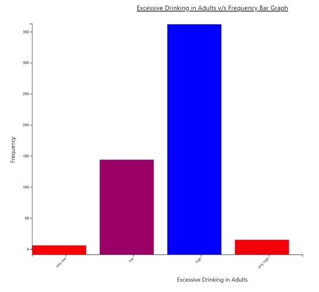
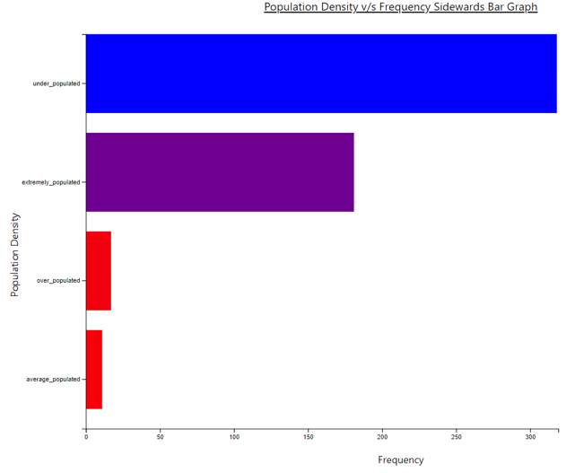
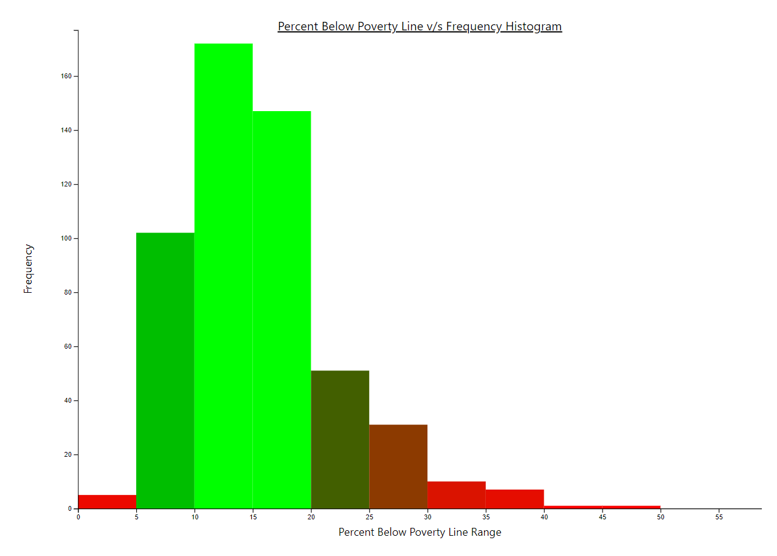
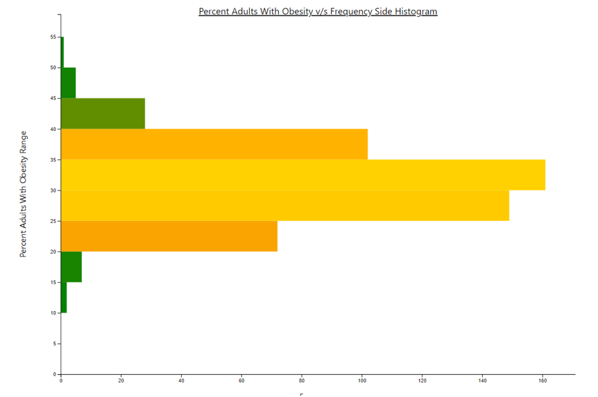
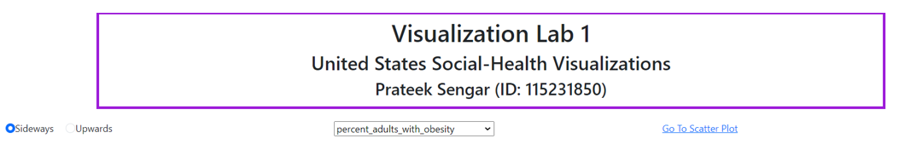
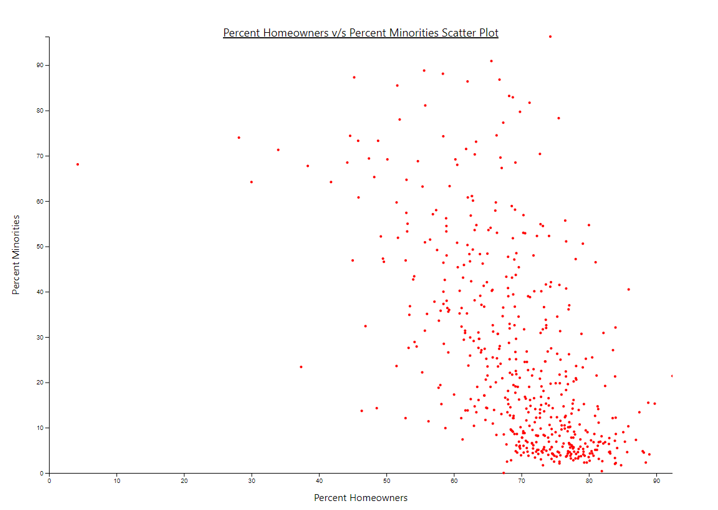
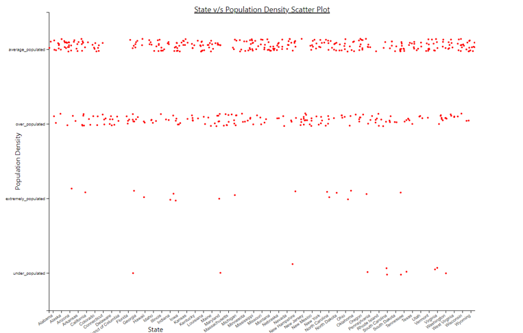
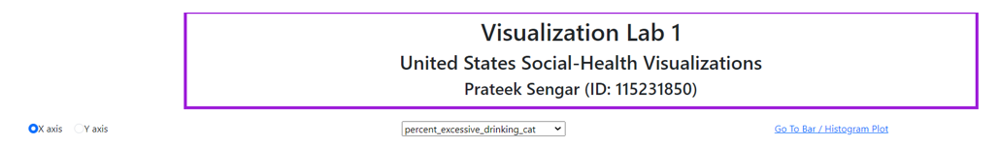

# Visualization Lab 1
## Prateek Sengar

## [Dashboard Demo](https://youtu.be/Llb5yN4RalY)

### Dataset
I was very intrigued by the data regarding the Social Health of the United States, hence I decided to go with it and notice some trends. The dataset had 181 columns and 3144 rows from which I chose 15 which I felt would describe the current social and health status of the United States as a whole. There was a lot of preprocessing that went into creating the final dataset. Some examples are removing the excessive columns and rows, dealing with NaN values, etc. The final dataset had 15 columns and 527 rows. Also, entries were each county and rows were selected by taking 3 of the most and least populous counties, and the remaining were average-populated counties for each state.

### Bar Graph
The basic idea behind the bar graph was to plot a categorical attribute (from the dataset) against its occurrence frequency in the dataset. Some of the work involved in creating a bar graph was counting the frequency values for each unique entry, colored bars according to their frequency, etc. There were two variants of the Bar Graph that were created according to their orientation as follows:

a. Upwards Bar Graph
   In this graph, the frequency is plotted on the y-axis, and the categories are plotted on the x-axis. The following is an example of the same.
   

b. Sideways Bar Graph
   In this graph, the frequency is plotted on the y-axis, and the categories are plotted on the x-axis. The following is an example of the same.
   

### Histogram
The basic idea behind the histogram was to plot a numerical attribute (from the dataset) against its occurrence frequency in the dataset. As it would be really difficult to account for every unique value from the dataset (as continuous values) we form bins of reasonable size and plot frequency against these bins. Some of the work involved in creating a bar graph was creating the bins, counting the frequency values for each unique bin, colored bars according to their frequency, etc. There were two variants of the Histogram that were created according to their orientation as follows:

a. Upwards Histogram
   In this graph, the frequency is plotted on the y-axis, and the bins are plotted on the x-axis. The following is an example of the same.
   

b. Sideways Histogram
   In this graph, the frequency is plotted on the x-axis, and the bins are plotted on the y-axis. The following is an example of the same.
   

### UI for Bar / Histogram
The option to choose whether to plot a sideways graph or an upwards graph is through a radio button. The option to choose the attribute is through a dropdown, and finally, a link to go to the scatter plotting section.

### Scatter Plot
The scatter plot is used when we have two attributes to plot. The x-axis represents one attribute and similarly, the y-axis represents the other. Now there can be many permutations depending on categorical and numerical attributes (a total of 4). I took into account all these permutations also, for overlapping points I added some jitter so that points are visible. The following are some examples:

The option to choose an axis (X or Y) is provided in the form of a radio button. After choosing the axis, there is an option to choose the attribute to plot using the dropdown. Note, we need to select both the x and y axis for the graph to appear by first selecting the axis and then the attribute. Also, there is a link to go back to the bar/histogram plotting section.

To run the HTML, initiate a Python server by "python -m http.server" and going to localhost:8000

### References
- Full Dataset: [US Counties COVID19 Weather Sociohealth Data](https://www.kaggle.com/datasets/johnjdavisiv/us-counties-covid19-weather-sociohealth-data)
